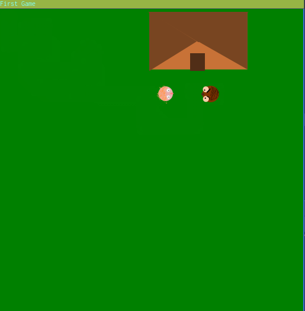

# Game Arcade

This game is about pushing your friends around.

the game requires `pygame` and `python-websocket-client` to be played

You can play with a friend and walk around 

First player need to launch `main.py` second player launch `second.py`

